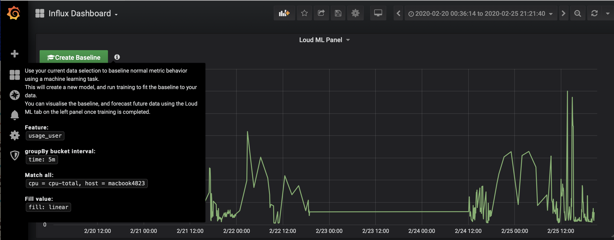

# LoudML Grafana Application

Visualization panel and datasource for Grafana to connect with Loud ML AI solution for ICT and IoT
automation. https://loudml.io

Loud ML is an open source inference engine for metrics and events, and the fastest way to embed machine learning in your time series application. This includes APIs for storing and querying data, processing it in the background for ML or detecting outliers for alerting purposes, and more.
https://github.com/regel/loudml

# What inside

Loud ML Panel - is a version of Grafana's default Graph Panel with a "Create Baseline" button
to create ML model in 1-click.

Loud ML Datasource - is a connector to Loud ML server. It has capabilities to show models and jobs on server. You can add new and edit existing models.

# Prerequisites

    * Loud ML server https://github.com/regel/loudml
    * Grafana >= 5.4.0

# Support

Please post issue to tracker or contact me via vova.sergeyev at gmail.com.
