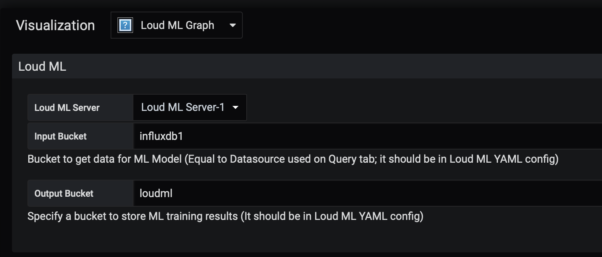
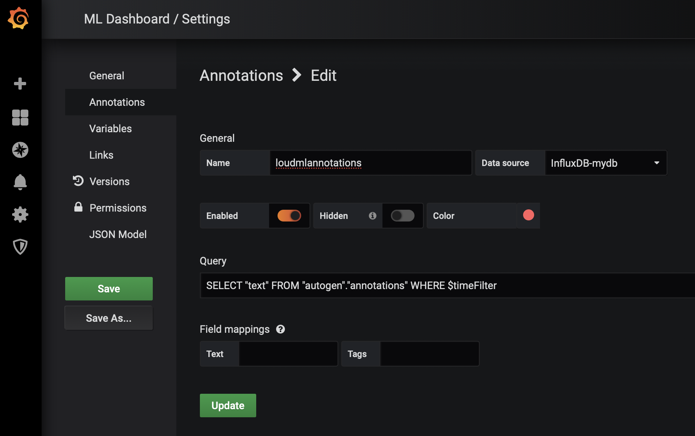

LoudML Grafana Application
==========================
<a href="https://github.com/vsergeyev/loudml-grafana-app">https://github.com/vsergeyev/loudml-grafana-app</a>

Datasource and Graph panel visualization to connect with Loud ML Machine Learning server.

Create a ML models in 1-click with "Create Baseline" button on graph.

 * select a time frame
 * click "Create Baseline"
 * train model
 * run a prediction
 * observe anomalies (as annotations on graph)

Watch this video on YouTube:

Loud ML (https://loudml.io/) uses Tensor Flow and Keras as a backend. It works with VAE models, combines the best of unsupervised and supervised learning. Based on a work "Unsupervised Anomaly Detection via Variational Auto-Encoderfor Seasonal KPIs in Web Applications" (https://arxiv.org/pdf/1802.03903.pdf) algorythm is best suitable to closely monitor various KPIs (DB connections, page views, number of online users, number of orders, etc).

Per ML algorythm documentation:

`Donut is an unsupervisedanomaly detection algorithm based on VAE. It greatly outperforms a state-of-arts super-vised ensemble approach and a baseline VAE approach, and its best F-scores range from 0.75 to 0.9 for the studied KPIs from a top global Internet company. ... Unlike discriminative models which are designed for just one pur-pose (e.g., a classifier is designed for just computing the classifi-cation probabilityp(y|x)), generative models like VAE can derivevarious outputs. `

# Prerequisites

    * Loud ML server https://github.com/regel/loudml
    * Grafana >= 5.4.0

# Configuration

In order to use Loud ML with Grafana you need to have a buckets in **loudml.yml** to reflect Grafana datasource(s) used in LoudML Graph

Example: I have InfluxDB datasource with **telegraf** database as an input and will use **loudml** database as output for ML model predictions/forecasting/anomalies:

    buckets:
     - name: loudml
       type: influxdb
       addr: 127.0.0.1:8086
       database: loudml
       retention_policy: autogen
       measurement: loudml
       annotation_db: loudmlannotations
     - name: influxdb1
       type: influxdb
       addr: 127.0.0.1:8086
       database: telegraf
       retention_policy: autogen
       measurement: loudml
     - name: data
       type: influxdb
       addr: 127.0.0.1:8086
       database: data
       retention_policy: autogen
       measurement: sinus
     - name: opentsdb1
       type: opentsdb
       addr: 127.0.0.1:4242
       retention_policy: autogen
     - name: prom1
       type: prometheus
       addr: 127.0.0.1:9090
       retention_policy: autogen

InfluxDB **loudmlannotations** here specified to store annotations. (By default Loud ML server will store annotations in **chronograf** database). So on Grafana dashboard annotations/anomalies from Loud ML should be configured as:

    SELECT "text" FROM "autogen"."annotations" WHERE $timeFilter

# Links

 * Creating a model for system usage metric https://www.youtube.com/watch?v=bxfU1N3ut70
 * Loud ML github.com/regel/loudml/
 * Forecasting time series with 1-click machine learning https://medium.com/loud-ml/forecasting-time-series-with-1-click-machine-learning-inside-the-tick-stack-c15dedb15035
 * Applying Machine Learning Models to InfluxDB https://medium.com/@dganais/applying-machine-learning-models-to-influxdb-with-loud-ml-docker-for-time-series-predictions-c4ffa4fc5174
